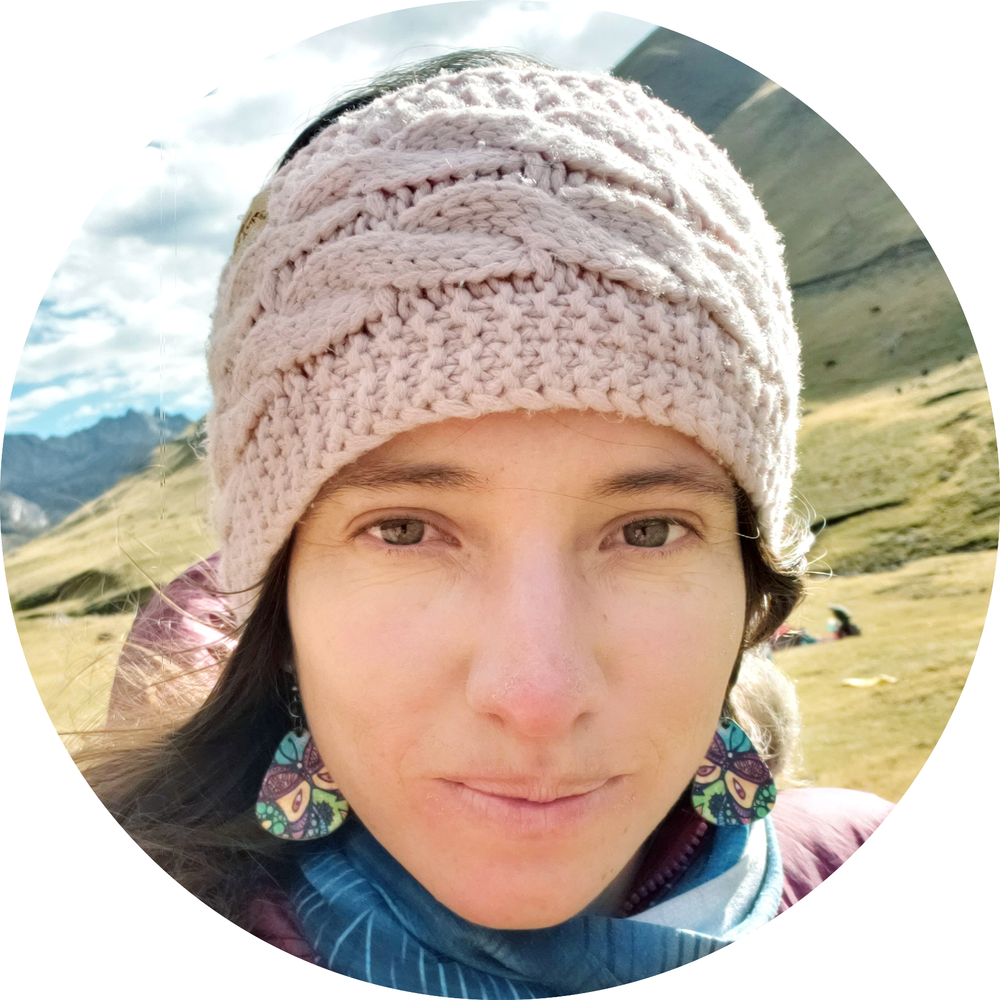
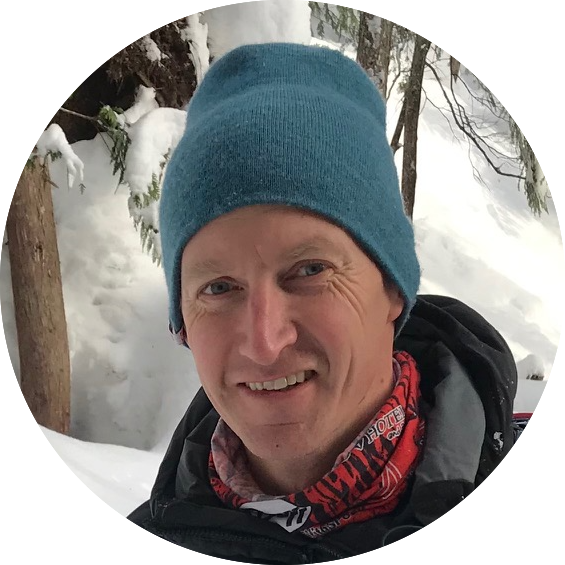
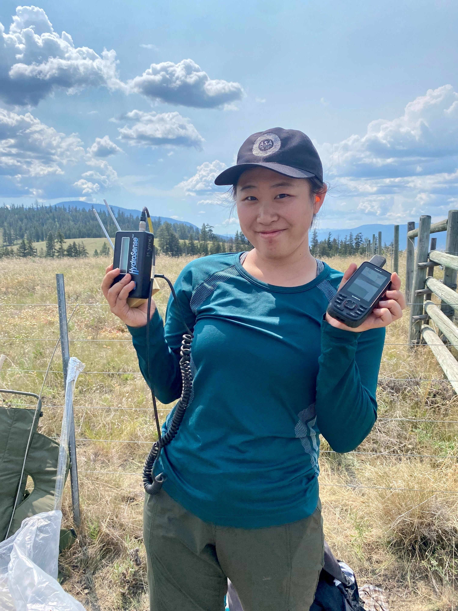
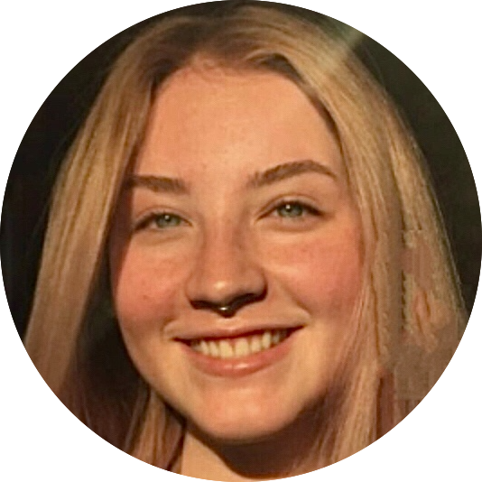
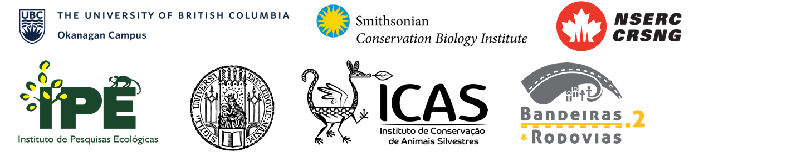

```{r setup, include=FALSE}
knitr::opts_chunk$set(echo = TRUE)
```
<script src="https://kit.fontawesome.com/e77fcc4fb5.js" crossorigin="anonymous"></script>

<header>
<div class="wrap">
<a id="HOME"></a> </br>

<center>

</br>
</br>

<div id="full">
The Quantitative Ecology Lab is focused on protecting vulnerable species. We use data driven approaches and cutting-edge statistics to ensure that the _evidence_ used to support evidence based conservation is both accurate and reliable.
</div>
        
</br>
</br>
</br>
</center>

</div>
</header>


</br>
</br>

</br>


<a id="PEOPLE"></a> </br>

<center> <h2>PEOPLE</h2> </center>

<center> <h3>QUANTITATIVE ECOLOGY LAB HEAD</h3> </center>

<center>


Dr. Michael Noonan |
<a href="mailto:michael.noonan@ubc.ca"><i class="fas fa-envelope"></i></a> 
<a href="https://twitter.com/MikeNoonanUBC"><i class="fab fa-twitter"></i></a> 
<a href="https://scholar.google.com/citations?user=O5Wu4jMAAAAJ&hl=en"><i class="fas fa-graduation-cap"></i></a> 
<a href="Files/Noonan_CV.pdf" target="_blank"><i class="fas fa-file-alt"></i></a>

Assistant Professor, Department of Biology

</center>

</br>


<center> <h3>RESEARCH ASSOCIATES</h3> </center>

<center>
<span style="font-size: 3em;">😊</span>


April Martinig |

Post-Doctoral, Department of Biology

<center>

</br>

<center> <h3>GRADUATE STUDENTS</h3> </center>

<center>


Stefano Mezzini |
<a href="mailto:stefano.mezzini@ubc.ca"><i class="fas fa-envelope"></i></a> 
<a href="https://scholar.google.ca/citations?user=DVhTn8QAAAAJ&hl=en&inst=17001591832933267808"><i class="fas fa-graduation-cap"></i></a> 
<a href="https://github.com/StefanoMezzini/"><i class="fab fa-github"></i></a>
<a href="https://www.researchgate.net/profile/Stefano_Mezzini/"><i class="fab fa-researchgate"></i></a> 

Doctoral Candidate, Department of Biology

</br>



Sandra Cuadros |
<a href="mailto:sandra.cuadros@ubc.ca"><i class="fas fa-envelope"></i></a> 
<a href="https://twitter.com/sandracuadros11"><i class="fab fa-twitter"></i></a> 
<a href="https://www.instagram.com/wayra_killari"><i class="fab fa-instagram"></i></a> 
<a href="https://www.linkedin.com/in/sandra-cuadros-a533506a/"><i class="fab fa-linkedin"></i></a> 

Doctoral Student, Department of Biology

</br>



Ryan Gill |
<a href="mailto:rygill@gmail.com"><i class="fas fa-envelope"></i></a>
<a href="https://github.com/rygill/"><i class="fab fa-github"></i></a>

MSc Student, Department of Biology

</br>


Lauren Mills |
<a href="mailto:mills.lauren@hotmail.com"><i class="fas fa-envelope"></i></a>
<a href="https://github.com/MillsCL/"><i class="fab fa-github"></i></a>

MSc Student, Department of Biology

</br>


Aimee Chhen |
<a href="mailto:katchhen@gmail.com"><i class="fas fa-envelope"></i></a>
<a href="https://github.com/aimeechhen/"><i class="fab fa-github"></i></a>

MSc Student, Department of Biology

</center>

</br>

<center> <h3>UNDERGRADUATE STUDENTS</h3> </center>

<center>


Erika Lin |
<a href="mailto:elinrg26@student.ubc.ca"><i class="fas fa-envelope"></i></a>
<a href="https://github.com/ErikaYLin"><i class="fab fa-github"></i></a>
<a href="https://www.linkedin.com/in/erika-y-lin/"><i class="fab fa-linkedin"></i></a> 

</br>

<span style="font-size: 3em;">😊</span>

Rekha Marcus | 

</br>

<span style="font-size: 3em;">😊</span>

Nozo Hirama|

</br>

<span style="font-size: 3em;">😊</span>

Daniella de Vries |
<a href="mailto:ddvries762@gmail.com"><i class="fas fa-envelope"></i></a>
<a href="https://www.linkedin.com/in/daniella-de-vries-1a0761184/"><i class="fab fa-linkedin"></i></a>

</br>

<span style="font-size: 3em;">😊</span>

Grace Lou |
<a href="mailto:gracelouyanlam@gmail.com"><i class="fas fa-envelope"></i></a>

</br>

<span style="font-size: 3em;">😊</span>

Victoria Baker |

</center>

</br>


<center> <h3> FORMER UNDERGRADUATE STUDENTS</h3> </center>


<center>


Dayna Westsrate | 2022-2023
<a href="mailto:daynakade@shaw.ca"><i class="fas fa-envelope"></i></a> 

</br>


Aimee Chhen | 2022-2023
<a href="mailto:katchhen@gmail.com"><i class="fas fa-envelope"></i></a> 

</br>

Evan Lewis | 2022

</br>

Joy Savanagouder | 2022

</center>


</br>

<a id="RESEARCH"></a> </br>


<center> <h2>RESEARCH</h2> </center>
</br>

<div style="text-align: left;">

Species conservation is a multi-faceted challenge that requires effort from people with skillsets ranging from applied ecology, economics, social sciences, data science, and biogeography to name only a few. For the efforts of this community to succeed, the evidence that is being used to inform conservation decisions must be accurate and reliable. UBC Okanagan's Quantitative Ecology Lab is focused on supporting the statistically efficient integration of data into ecological theory and conservation initiatives. To this end, the lab's work follows a step-wise process of methods development, testing, refinement, and application structured around two separate, but complimentary lines of research. The first falls under an umbrella called 'Biology or bias', and is aimed at understanding when/why different statistical approaches lead to differing conclusions, and how to avoid estimation bias. The second focuses on macro-ecology and global conservation by pairing high quality data with cutting edge analytical tools.

## Biology or Bias

Technological advances are transforming ecology as a field. Ecologists are now in a position to collect more accurate data for a larger number of species and individuals, and in more ecosystems than ever before. Problematically, however, statistical techniques for analysing these new and challenging datasets often lag behind. Worse, pairing these data with conventional statistical tools can lead to biased and potentially misleading results. With these issues in mind, the Quantitative Ecology Lab aims to bridge the gap between technological advances and practical ecology. Using carefully tailored experiments, we aim to clarify when analyses will work, when they should be avoided, what conditions cause them to fail, and to what extent that failure might be. This work provides researchers with the novel tools and practical guidelines needed to reliably answer ecological and conservation relevant questions from challenging and nuanced datasets.
</br>
</br>


</br>
</br>

## Macro-ecology and Global Conservation

The Quantitative Ecology lab has established an international team, comprised of >80 of the world’s leading movement ecologists. Through this network of specialists, we have built one of the largest animal tracking dataset ever assembled, consisting of 1300 individuals representing 76 mammalian and avian species. With the average, all-in cost of tracking an animal being [∼$9,500](https://doi.org/10.1071/WR10211), this dataset can be valued at >$11 million. Collectively this unprecedented dataset, and broad pool of expert knowledge make our team uniquely positioned to support global conservation efforts. Our lab uses these data to answer questions about the evolutionary history and function of key aspects of animal movement. We then use these higher level findings to contextualise species' responses to human induced rapid environmental change (HIREC), and provide actionable findings for species conservation.
</br>
</br>

</div>

<center>

</center>


<a id="PUBLICATIONS"></a> </br>


<center> <h2>PUBLICATIONS</h2> </center>
</br>

<div style="text-align: left;">

<a href="#CONTACT">Contact</a> the lab if you would like PDFs of any of the publications listed on this page.

</br>

#### 2024   {.tabset} 

* __Westsrate D__, __Chhen A__, __Mezzini S__ & __Noonan MJ__. (2024) How climate change and population growth will shape attendance and human-wildlife interactions at British Columbia parks. DOI: https://doi.org/10.1080/09669582.2024.2331228.

##### 2023

* __Chhen A__, Bertassoni A, Desbiez ALJ & __Noonan MJ__. (2023) The socio-spatial ecology of giant anteaters in the Brazilian Cerrado. bioRxiv; DOI: https://doi.org/10.1101/2023.10.04.560744.

* __Gill R__, Serrouy R, Calver AM, Ford A, Steenwe R & __Noonan MJ__. (2023) Movement ecology of endangered caribou during a COVID-19 mediated pause in winter recreation. Animal Conservation; DOI: https://doi.org/10.1111/acv.12912.

* __Mezzini S__, Fleming CH, Medici EP, & __Noonan MJ__. (2023) How resource abundance and stochasticity affect organisms’ space-use requirements. bioRxiv; DOI: https://doi.org/10.1101/2023.11.03.565563. 

* __Noonan MJ__, Grechi N, __Mills CL__ & Ferraz MAMM (2023) Microplastics analytics: why we should not underestimate the importance of blank controls. Microplastics and Nanoplastics, 3(17), 1-8; DOI: https://doi.org/10.1186/s43591-023-00065-3.

*  __Mills CL__, __Savanagouder J__, Ferraz MAMM, & __Noonan MJ__ (2023) The need for environmentally realistic studies on the health effects of terrestrial microplastics. Microplastics and Nanoplastics, 3(11), 1-6; DOI: https://doi.org/10.1186/s43591-023-00059-1.

##### 2022

* __Mills CL__, __Savanagouder J__, Ferraz MAMM, & __Noonan MJ__. (2022) The need for ecologically realistic studies on the health effects of microplastics. bioRxiv; DOI: https://doi.org/10.1101/2022.11.21.517421.

* Socias-Martínez L, Peckre LR, & __Noonan MJ__. (2022) Are trapping data still suited for home range estimation? An analysis with various estimators, asymptotic models and data ordering procedures. bioRxiv; DOI: https://doi.org/10.1101/2022.03.15.484432.

* Medici EP, __Mezzini S__, Fleming CH, Calabrese JM, & __Noonan MJ__. (2021) Movement ecology of vulnerable lowland tapirs across a gradient of human disturbance. Movement Ecology, 10(1), 1-12; DOI: https://doi.org/10.1186/s40462-022-00313-w.

* Milazzotto MP, __Noonan MJ__, & Ferraz MAMM. (2021) RNAseq analysis reveals dynamic metaboloepigenetic profiles of human, mouse and bovine pre-implantation embryos. iScience, 25(3), 103904; DOI: https://doi.org/10.1101/2021.06.25.449773.

* Fleming CH, Deznabi I, Alavi S, Crofoot MC, Hirsch BT, Medici EP, __MJ Noonan__, Kays R, Fagan WF, Sheldon D, & JM Calabrese JM (2022) Population-level inference for home-range areas. Methods in Ecology and Evolution, 13(5); 1027-1041; DOI: https://doi.org/10.1111/2041-210X.13815.

* __Noonan MJ__, Fagan WF, & Fleming CH. (2022) A semi-variance approach to visualising phylogenetic autocorrelation. Methods in 13(2), 396 – 406; DOI: https://doi.org/10.1111/2041-210X.13763.

* Silva I, Fleming CH __Noonan MJ__, Alston J, Folta C, Fagan WF, & Calabrese JM. (2022) A semi-variance approach to visualising phylogenetic autocorrelation. Methods in Ecology and Evolution, 13(3), 534 – 544. DOI: https://doi.org/10.1111/2041-210X.13786.

##### 2021

* Fleming CH, Drescher-Lehman J, __Noonan MJ__ (with 34 other authors)..., & Calabrese JM. (2021) A comprehensive framework for handling location error in animal tracking data. bioRxiv; DOI: https://doi.org/10.1101/2020.06.12.130195.

* __Noonan MJ__, Ascensão F, Yogui DR, Desbiez ALJ. Roads as ecological traps for giant anteaters. Animal Conservation, 25(2), 182 – 194. DOI: https://doi.org/10.1111/acv.12728.

* __Noonan MJ__...(11 other authors)..., & Calabrese JM. (2021) Estimating encounter location distributions from animal tracking data. Methods in Ecology and Evolution, 12(7), 1158 – 1173. DOI:  https://doi.org/10.1111/2041-210X.13597.

* Calabrese JM, Fleming CH, __Noonan MJ__, & Dong X. (2021) Point-and-click AKDE home range estimation with ctmmweb. Wildlife Society Bulletin, 45(1), 162 – 169.  DOI: https://doi.org/10.1002/wsb.1154.

##### 2020

* Ferraz MAMM, Nagashima JB, __Noonan MJ__, Crosier AE, & Songsasen N. (2020) Oviductal extracellular vesicles improve red wolf and cheetah sperm function post-thawing. International Journal of Molecular Science, 21(10), 3733; DOI: https://doi.org/10.3390/ijms21103733.

* Ferraz MAMM, Fujihara M, Nagashima JB, __Noonan MJ__, Inoue-Murayama M & Songsasen N. (2020) Cat follicular extracellular vesicles contain proteins regulating cell signaling pathways that enhance meiotic resumption of vitrified oocytes. Scientific Reports, 10, 8619; DOI: https://doi.org/10.1038/s41598-020-65497-w.

* __Noonan MJ__, Fleming CH, ...(76 other authors)..., and Calabrese JM. (2020) Effects of body size on estimation of mammalian area requirements. Conservation Biology, 34(3), 1017 – 1028; DOI: https://doi.org/10.1111/cobi.13495.


##### 2019

* __Noonan MJ__, Fleming CH, Akre T, Dresher-Lehman J, Gurarie E, Harrison AL, Kays R & Calabrese JM. (2019) Scale-insensitive estimation of speed and distance travelled from animal tracking data. Movement Ecology, 7(35), 1 – 15; DOI: https://doi.org/10.1186/s40462-019-0177-1.

* __Noonan MJ__, Tinnesand HV, Müller CT, Rosell F, Macdonald DW, & Buesching CD. (2019) Knowing me, knowing you: anal gland secretion of European badgers (_Meles meles_) codes for individuality, sex and social group membership. Journal of Chemical Ecology, 45, 823 – 837; DOI: https://doi.org/10.1007/s10886-019-01113-0.

* Fleming CH, __Noonan MJ_, Medici E, & Calabrese, JM. Overcoming the challenge of small effective sample sizes in home-range estimation. (2019) Methods in Ecology and Evolution, 10(10), 1679 – 1689; DOI: https://doi.org/10.1111/2041-210X.13270.

* Ishii H, Yamazaki K, __Noonan MJ__, Buesching CD, Newman C, & Kaneko Y. (2019) Testing cellular-phone enhanced GPS tracking technology for urban carnivores. Animal Biotelemetry, 7(19), 1–13; DOI: https://doi.org/10.1186/s40317-019-0180-8.

* Ferraz MAMM, Carothers A, Dahal R, __Noonan MJ__, & Songsasen N. (2019) Oviductal extracellular vesicles interact with the spermatozoon's head and mid-piece and improves its motility and fertilizing ability in the domestic cat. Scientific Reports, 9(9484), 1–12; DOI: https://doi.org/10.1038/s41598-019-45857-x.

* Tucker M, ... __Noonan MJ__ (with 62 other authors)..., & Mueller T. (2019) Large birds travel farther in homogeneous environments. Global Ecology and Biogeography, 28(5), 1–12; DOI: https://doi.org/10.1111/geb.12875.

* __Noonan MJ__, ...(53 other authors)..., & Calabrese JM. (2019). A comprehensive analysis of autocorrelation and bias in home range estimation. Ecological Monographs, 89(2):e01344; DOI: https://doi.org/10.1002/ecm.1344.

##### 2018

* __Noonan MJ__, Newman C, Markham A, Buesching CD, Bilham K, & Macdonald DW. (2018) _In situ_ behavioral plasticity as compensation for weather variability: implications for future climate change. Climatic Change, 149(3-4), 457–471; DOI: https://doi.org/10.1007/s10584-018-2248-5.

* Winner K, __Noonan MJ__, Fleming CH, Olson KA, Mueller T, Sheldon D, & Calabrese JM. (2018) Statistical inference for home range overlap. Methods in Ecology and Evolution, 9(7), 1679–1691; DOI: https://doi.org/10.1111/2041-210X.13027.

* __Noonan MJ__, Tinnesand HV, & Buesching CD. (2018) Normalizing Gas-Chromatography–Mass Spectrometry Data: Method Choice can Alter Biological Inference. BioEssays, 40(6), 1–12; DOI: https://doi.org/10.1002/bies.201700210.

* Bilham K, Newman C, Buesching CD, __Noonan MJ__, Boyd AC, Smith AL, & Macdonald DW. (2018) The effects of weather conditions on oxidative stress, oxidative damage and antioxidant capacity in a wild-living mammal, the European badger (_Meles meles_). Physiological and Biochemical Zoology, 91(4), 987–1004; DOI: https://doi.org/10.1086/698609.

* Fleming CH, Sheldon D, Fagan WF, Leimgruber P, Mueller T, Nandintsetseg D, __Noonan MJ__, Olson KA, Setyawan E, Sianipar A, & Calabrese JM. (2018) Correcting for missing and irregular data in home-range estimation, Ecological Applications, 28(4), 1003–1010; DOI: https://doi.org/10.1002/eap.1704.

##### 2017

* Johnson PJ, __Noonan MJ__, Kitchener A, Harrington LA, Newman C, & Macdonald DW. (2017) Rensching Cats and Dogs: Feeding ecology and fecundity trends explain variation in the allometry of sexual size dimorphism. Royal Society Open Science, 4(6): 170453; DOI: https://doi.org/10.1098/rsos.170453.

##### 2016

* __Noonan MJ__, Johnson PJ, Kitchener A, Harrington LA, Newman C, & Macdonald DW. (2016) Sexual size dimorphism in musteloids: An anomalous allometric pattern is explained by feeding ecology. Ecology and Evolution, 6(23): 8495–8501; DOI: https://doi.org/10.1002/ece3.2480.

##### 2015

* Tinnesand HV, Buesching CD, __Noonan MJ__, Newman C, Zedrosser A, Rosell F, & Macdonald DW. (2015) Will Trespassers Be Prosecuted or Assessed According to Their Merits? A Consilient Interpretation of Territoriality in a Group-Living Carnivore, the European Badger (_Meles meles_). PLoS One, 10(7), e0132432; DOI: https://doi.org/10.1371/journal.pone.0132432.

* __Noonan MJ__, Newman C, Buesching CD, & Macdonald DW. (2015) Evolution and function of fossoriality in the Carnivora: implications for group-living. Frontiers in Ecology and Evolution, 3(116), 1–14; DOI: https://doi.org/10.3389/fevo.2015.00116.

* __Noonan MJ__, Abidur Rahman M, Newman C, Buesching CD, & Macdonald DW. (2015) Avoiding verisimilitude when modelling ecological responses to climate change: The influence of weather conditions on trapping efficiency in European badgers (_Meles meles_). Global Change Biology, 21(20), 3575–3585; DOI: https://doi.org/10.1111/gcb.12942.

* __Noonan MJ__, Markham A, Newman C, Trigoni N, Buesching CD, Ellwood SA, & Macdonald DW. (2015) A new Magneto-Inductive tracking technique to uncover subterranean activity: What do animals do underground? Methods in Ecology and Evolution, 6(5), 510–520; DOI: https://doi.org/10.1111/2041-210X.12348.

##### 2014

* __Noonan MJ__, Markham A, Newman C, Trigoni N, Buesching CD, Ellwood SA, & Macdonald DW. (2014) Climate and the Individual: Inter-Annual Variation in the Autumnal Activity of the European Badger (_Meles meles_). PloS One, 9(1), e83156; DOI: https://doi.org/10.1371/journal.pone.0083156.

##### 2012

* __Noonan MJ__, Grant JWA, & Jackson CD. (2012) A quantitative assessment of fish passage efficiency. Fish and Fisheries, 13(4), 450–464; DOI: https://doi.org/10.1111/j.1467-2979.2011.00445.x.

## {-}

</div>

<a id="NEWS"></a> </br>
<center>

</center>

<center> <h2>NEWS</h2> </center>
</br>

<div style = "text-align: left;">

#### 2024 {.tabset} 

* Great news! Erika has placed 3rd in virtual presentations at the Multidisciplinary Undergraduate Research Conference hosted by UBC, where she presented her Honour's research on developing a software package for user-friendly microbiome analysis. Congratulation Erika!

* Fresh off the presses! Dayna's first authored research paper, "How climate change and population growth will shape attendance and human-wildlife interactions at British Columbia parks" has been accepted and has been published in the Journal of Sustainable Tourism. Read it here:  https://doi.org/10.1080/09669582.2024.2331228. Congratulations Dayna!

* Erika Lin has been awarded the NSERC Undergraduate Research Grant for a project focused on habitat connectivity by reviewing and developing statistical methods for the estimation of migratory corridors. Congratulations Erika!

* Exciting news! Erika will be presenting at the MURC conference in British Columbia on a user-friendly software package in R for processing microbial genetic data.

* Sandra Cuadros received the TWS travel grant to present her work at Wildlife Society Conference in Jasper, AB. Congratulations Sandra! 

* Exciting news! Stefano, Sandra, Lauren and Aimee will be presenting their research at the Wildlife Society Conference in Jasper, AB.

* April Martining is joining the lab as a post-doctoral researcher. Welcome April!

* The Quantitative Ecology Lab participated in Experience UBCO 2024. Great turn out! Visitors were able to get their first experience in simulating animal movement.

* Fantastic News! Stefano Mezzini has successfully passed his doctoral comprehensive exam. Congratulations Stefano! 

* Victoria Baker is joining the lab to carry out a Directed Studies project focused on how timber harvest affects woodland caribou habitat and conservation. Welcome Victoria!

##### 2023 

* Aimee Chhen has been officially admitted to the MSc program at UBC-O. Welcome back Aimee!

* Exciting news! Stefano will be presenting at the Gordon Research Conference and Gordon Research Seminar in Barga, Italy, on the effects of resource abundance and stochasticity on orgamism's space-use requirements. 

* Stefano Mezzini received the UBCO travel grant to present his work at the the Gordon Research Conference and Gordon Research Seminar in Barga, Italy. Congratulations Stefano! 

* Grace Lou is joining the lab to carry out an Honours project focused on modelling human wildlife conflicts with productivity in Canadian National Parks. Welcome Grace!

* Daniella de Vries is joining the lab to carry out an Honours project the recovery rate of productivity of forests after disturbance events from wildfires and cut blocks in the Okanagan. Welcome Daniella!

* Nozomu Hirama is joining the lab to carry out an Honours project focused on modelling long-term trends in mammalian sperm quality. Welcome Nozo!

* Great news! Rekha Marcus has been awarded the Irving K. Barber Faculty of Science Undergraduate Research Award to study environmental conditions in protected areas and how we can better select protected areas. Congratulations Rekha!

* Great News! Erika Lin has been awarded the UBCO Irving K. Barber Faculty of Science Undergraduate Research Award to building a workflow to study the effects of microplastics on soil microbiota. Congratulations Erika!

* Rekha Marcus is joining the lab to carry out an Honours project focused on environmental conditions in protected areas and how we can better select protected areas. Welcome Rekha!

* Erika Lin is joining the lab to carry out an Honours project focused on developing a user-friendly software package in R for processing microbial genetic data. Welcome Erika!

* Exciting news! Dayna will be presenting at the MURC conference in British Columbia on the effect of climate change and population growth on attendance in BC Parks.

* Stefano Mezzini has officially been admitted to fast-track to a PhD degree. Congratulations Stefano!

##### 2022

* Exciting news! Stefano presented at the PARF conference in Nanaimo, British Columbia, on the effects of temperature and climate change on mammal movement in British Columbia.

* Exciting news! Dayna presented at the PARF conference in Nanaimo, British Columbia, the effect of climate change and population growth on attendance in BC Parks.

* Exciting news! Stefano Mezzini was awarded the Top Talk and People's Choice at the UBC Okanagan Biology Graduate Symposium. Congratulations Stefano!

* Stefano Mezzini has received funding from Living Labs to study the effects of temperature and climate change on mammal movement in British Columbia. Congratulations Stefano! 

* Evan Lewis is joining the lab to carry out a Directed Studies project on avian ecology. Welcome Evan!

* Aimee Chhen is joining the lab to carry out a Directed Studies project focused on the sociality of Giant Anteater in Brazil and an additional project on the human-wildlife interactions in National Parks in British Columbia. Welcome Aimee!

* Dayna Westsrate is joining the lab to carry out an Honours project focused on the effect of climate change and population growth on attendance in BC Parks. Welcome Dayna!

* Joy Savanagouder is joining the lab to carry out a summer research project focused on terrestrial microplastics. Welcome Joy!

* Stefano Mezzini has received funding from MITACS to study the impacts of COVID-19 induced travel restrictions on southern mountain caribou. Congratulations Stefano! 

* Ryan Gill has received funding from Environment and Climate Change Canada to study the impacts of COVID-19 induced travel restrictions on southern mountain caribou. Congratulations Ryan!

* Sandra Cuadros has received a Future Conservationist Award (Conservation Leadership Programme). Congratulations Sandra!

* Lauren Mills has been officially admitted to graduate programs at UBC-O to study. Welcome Lauren!

* Good news! We've received funding from BC Parks to study the effects of climate change on mammals in BC. Funds will go to supporting student salaries.

* Good news! We've received funding from Ludwig Maximilian University of Munich to study the effects of micro-plastics in terrestrial systems. Funds will go to hiring a lab-technician who will be based in Germany. Details here: https://twitter.com/MarciaFerraz11/status/1479197095076798466/photo/1

##### 2021

* Graduate student Sandra Cuadros has been awarded a Graduate Dean's Entrance Scholarship. Congratulations Sandra!

* Two new members have been officially admitted to graduate programs at UBC-O. Welcome Sandra Cuadros and Ryan Gill!

* Graduate student Stefano Mezzini has been awarded a Graduate Dean's Entrance Scholarship. Congratulations Stefano!

* Stefano Mezzini has been officially admitted to the MSc program at UBC-O. Welcome Stefano!

* The Quantitative Ecology Lab has been awarded an [NSERC Discovery Grant](https://www.nserc-crsng.gc.ca/NSERC-CRSNG/FundingDecisions-DecisionsFinancement/ResearchGrants-SubventionsDeRecherche/ResultsGSCDetail-ResultatsCSSDetails_eng.asp?Year=2021&GSC=1503) to support the lab's work over the next 5 years.

## {-}

</div>

<a id="OPPORTUNITIES"></a> </br>


<center> <h2>OPPORTUNITIES</h2> </center>

<div style = "text-align: left;">

There are currently no open positions for which we are actively recruiting. However, if you're interested in joining the Quantitative Ecology Lab, you are welcome to email us your CV, unofficial transcripts, a brief blurb about yourself and your interests, and what aspects of the lab's research interest you.

</br>

__General guidelines for prospective students__:
We expect prospective students to have consulted the general information provided at the Biology Graduate program webpage prior to contacting me.  Students in the Quantitative Ecology Lab gain valuable experience in quantitative methods, data management / analysis, `R` usage, and `R` package development.  These skills and experiences are aimed at helping our students find full time employment and / or further their academic careers.

</br>

Prospective students are encouraged to seek their own sources of external funding (e.g. NSERC), and to be competitive for internal grants available at UBC. 

</br>

General information about graduate studies at the Okanagan campus and in biology:

[UBC Okanagan Biology graduate program](https://biology.ok.ubc.ca/graduate/biology/)

[Graduate School at UBC Okanagan](https://gradstudies.ok.ubc.ca)
</br>
&nbsp;

## {-}

</div>

<a id="FUNDING"></a> </br>

<center> <h2>FUNDING & PARTNERS</h2> </center>
</br>
&nbsp;

<div class="full-width">


<center>

</center>
</div>